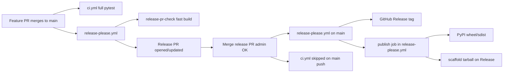

# Release automation setup (one-time)

`release-please` failed on `main` with:

```text
GitHub Actions is not permitted to create or approve pull requests.
```

The workflow **did** prepare a release branch (`release-please--branches--main--components--loco-llm-cli`) with version **0.3.0** and `CHANGELOG.md`. Only opening the release **pull request** was blocked.

## 1. Enable Actions to open PRs (required)

In GitHub: **Settings → Actions → General → Workflow permissions**

1. Select **Read and write permissions** (recommended default for this repo).
2. Enable **Allow GitHub Actions to create and approve pull requests**.
3. Save.

Or with `gh` (repo admin):

```bash
gh api repos/mtopcu1/local-llm-scaffold/actions/permissions/workflow \
  -X PUT \
  -f default_workflow_permissions=write \
  -F can_approve_pull_request_reviews=true
```

Then confirm the checkbox above is still enabled in the UI (some org policies require both).

## 1b. Require CI before merge (recommended)

`main` is protected so **feature PRs** cannot merge unless these checks pass:

- `test (3.11)`
- `test (3.12)`
- `build-check`

**Release PRs** (`release-please--…` branches) skip full CI — they only change version/changelog files. Merge them after the **`release-please` workflow** shows a green **`release-pr-check`** job (fast build + version sync). GitHub may not attach those checks to the PR itself (bot-opened PR limitation); use admin bypass if the PR stays blocked with no checks.

Configured via **Settings → Branches → Branch protection rules** (or `gh api` on `repos/mtopcu1/loco-llm/branches/main/protection`).

## 2. Re-run release-please

After step 1, either:

**Option A — Re-run the failed workflow**

```bash
gh run rerun 26068828647 --repo mtopcu1/local-llm-scaffold
```

Or **Actions → release-please → Run workflow** (uses `workflow_dispatch` on `main`).

**Option B — Open the release PR manually** (if the branch already exists)

```bash
gh pr create \
  --repo mtopcu1/local-llm-scaffold \
  --head release-please--branches--main--components--loco-llm-cli \
  --base main \
  --title "chore(main): release 0.3.0" \
  --body "Release PR prepared by release-please. Review CHANGELOG and version bumps, then merge."
```

## 3. PyPI trusted publishing (before first real release)

When you merge the release PR, **`release-please.yml`** publishes (same workflow run, `releases_created == true`). The standalone `publish.yml` is a manual fallback only — GitHub does not fire `release: published` workflows for releases created by `GITHUB_TOKEN`.

1. [pypi.org](https://pypi.org) → **Publishing** → add trusted publisher(s):
   - Owner: `mtopcu1`
   - Repository: `loco-llm` (or `local-llm-scaffold` if that is still the linked repo)
   - Workflow: **`release-please.yml`** (primary) and optionally `publish.yml` (manual fallback)
   - Environment: (leave empty unless you use one)
2. Register the project name `loco-llm-cli` on PyPI if not already claimed.

To backfill a release that shipped without assets (e.g. v0.3.1): **Actions → publish → Run workflow** with tag `v0.3.1`.

## 4. Expected flow after setup



**Why CI runs again after merging the release PR:** `ci.yml` triggers on every push to `main`. That used to re-run the full suite for a 4-file version bump. Release merges whose commit message contains `release-please--` now **skip** `ci.yml` entirely — only `release-please.yml` runs (which exits quickly with “0 commits” after a release, plus publish when applicable).

## 5. Commit message warnings (normal)

Logs may show `commit could not be parsed` for merge commits (`Merge pull request #…`) or old non-conventional messages. Those commits are **skipped**; `feat:` / `fix:` commits since `0.2.0` still drive the **0.3.0** bump.
