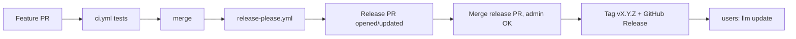

# Release automation setup (one-time)

## 1. Enable Actions to open PRs

GitHub → Settings → Actions → General → Workflow permissions:

- Read and write permissions
- Allow GitHub Actions to create and approve pull requests

Without these, release-please can prepare a release branch but cannot open the PR.

## 2. Branch protection on `main`

Require one status check: `test`. Allow admin bypass — release PRs are opened
by `github-actions[bot]` and don't get checks attached (a GitHub limitation,
not a workflow bug). The release PR only edits version + CHANGELOG; review
the diff and admin-merge.

## 3. There is no PyPI

Distribution is by git tag. Merging the release PR creates the tag and a
GitHub Release with the CHANGELOG. `llm update` consumes the tag. No PyPI
trusted publisher to configure, no wheel to upload, no scaffold tarball.

## 4. Flow

